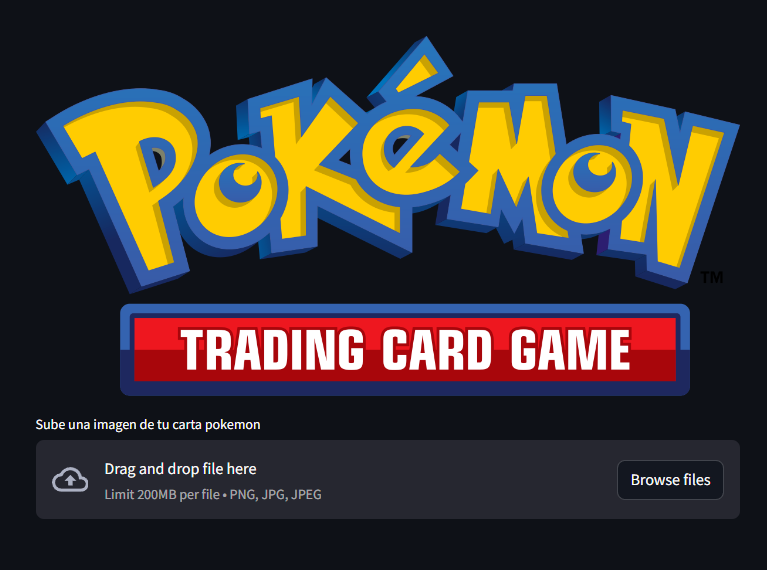
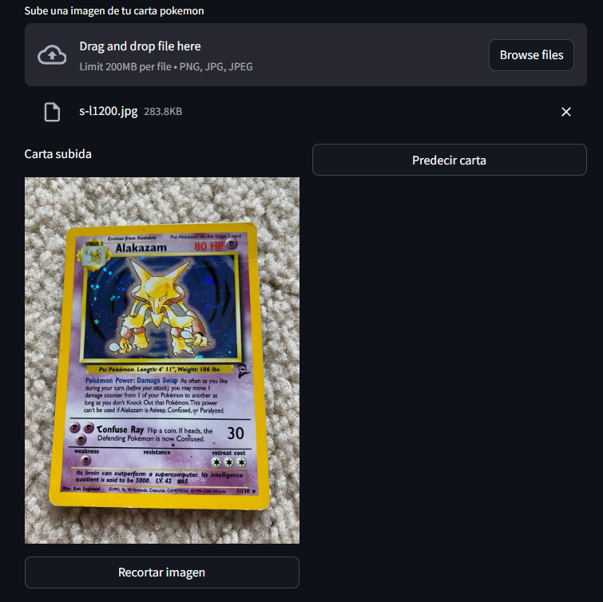
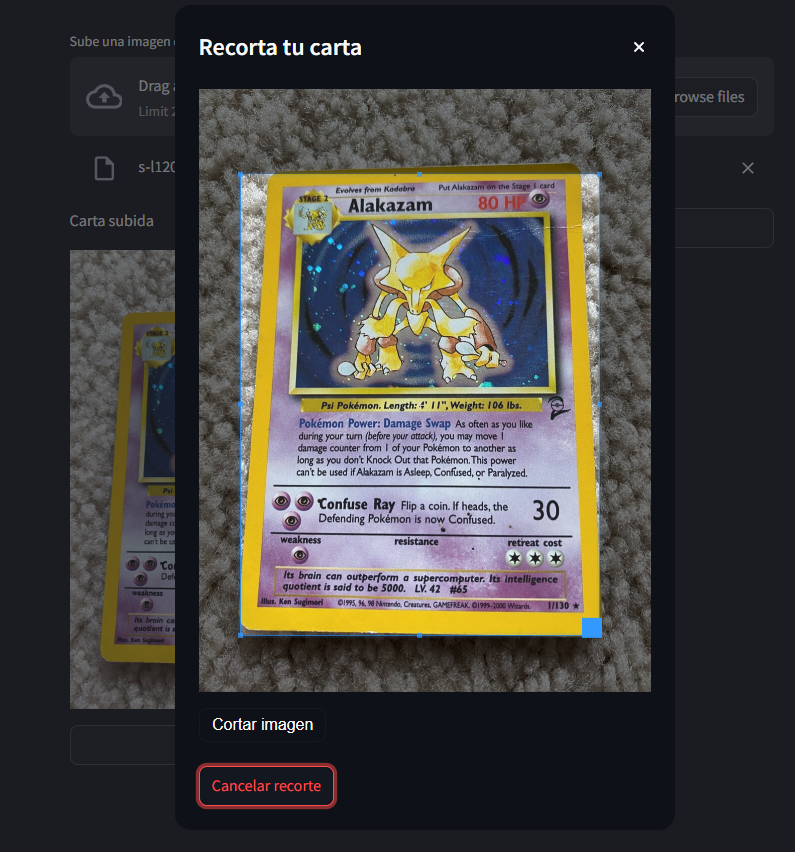
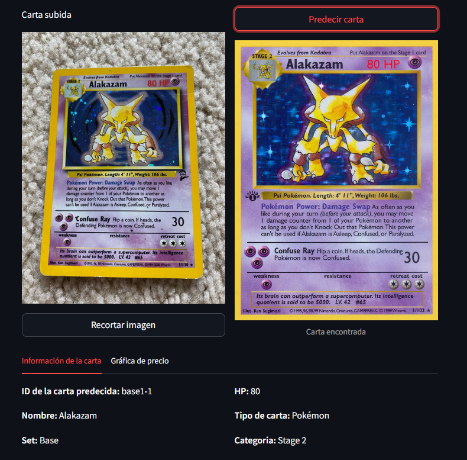
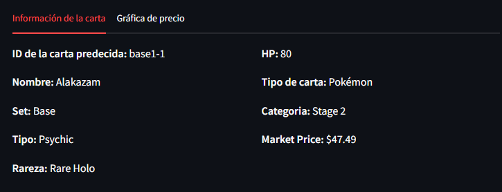
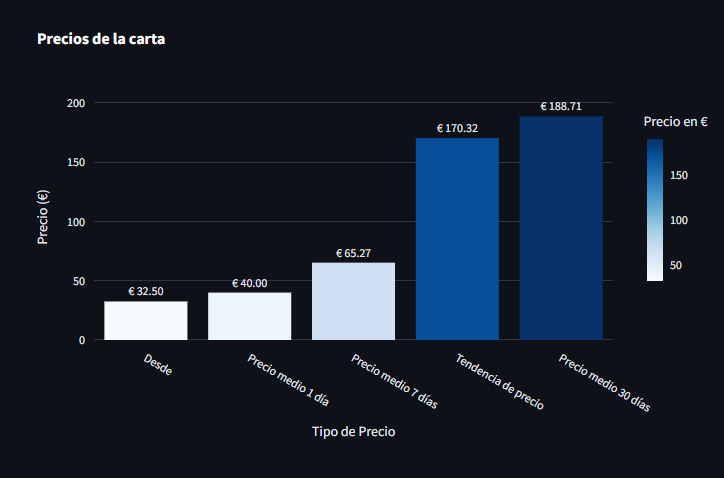

# Proyecto Cartas Pokémon

Este repositorio contiene una aplicación para predecir y clasificar cartas de Pokémon utilizando técnicas de aprendizaje automático. La aplicación permite a los usuarios cargar imágenes de cartas de Pokémon y obtener información detallada sobre ellas, incluyendo su nombre, set, tipo, rareza, HP, y más.

## Funcionalidades de la Aplicación

- **Carga de Imágenes**: Los usuarios pueden cargar imágenes de cartas de Pokémon para su análisis.
- **Recorte de Imágenes**: La aplicación permite recortar las imágenes cargadas para enfocarse en la carta.
- **Predicción y Clasificación**: Utilizando un modelo de aprendizaje automático, la aplicación predice y clasifica la carta cargada.
- **Visualización de Información**: Muestra información detallada sobre la carta, incluyendo su nombre, set, tipo, rareza, HP, y más.
- **Gráfica de Precios**: Proporciona una gráfica de precios de la carta en diferentes mercados.

## Guía del Usuario

### Acceso a la Aplicación

La aplicación está disponible en línea y se puede acceder a través del siguiente enlace:

[https://cartaspokemon.streamlit.app](https://cartaspokemon.streamlit.app)

### Uso

-  Al acceder a la aplicación de streamlit vera la siguiente pantalla:

- Aqui podra introducir una imagen de la carta poekmon del que quiera buscar información usando el boton "Browse files" o arrastrando la imagen sobre el recuadro en el que se encutra el boton (Solo estan permitido imagenes de formato .PNG, .JPG y .JPEG), al introducir una imagen vera una pagina parecida:

- Aqui se le presenta la opcion de poder recortar la imagen (Debajoi de la imagen que se ha subido) o usar la imagen para que el modelo intente averiguar de que carta se trata. En principio vamos a recortar la imagen:

- Aqui vera esta pantalla pero con la imagen que se haya subido, aqui se le permitira seleccionar que parte de la imagen usar, aqui tiene la opcion aceptar el recorte (Cortar imagen) o cancelar el recorte (Cancelar recorte).

- Tras darle al boton de predecir carta, el modelo procesara la imagen y devolera la que piensa que es (Si el resultado es erroneo recorte la imagen o pruebe con otra)

- Debajo tendra una pentaña con la informacion de la carta y la opcion de ver la grafica del precio de la carta

Ejemplo con la carta de prueba

### Estructura del Proyecto

- `app.py`: Archivo principal de la aplicación Streamlit.
- `data/`: Contiene los archivos CSV con los datos de las cartas.
- `model/`: Contiene los modelos de aprendizaje automático y notebooks de Jupyter.
- `img/`: Contiene imágenes utilizadas en la aplicación.
- `requirements.txt`: Lista de dependencias necesarias para ejecutar la aplicación.